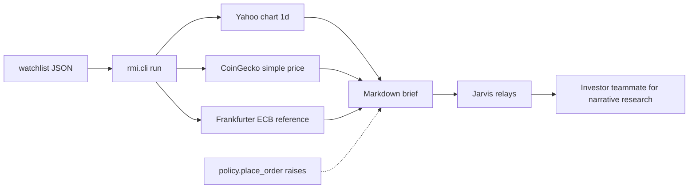

# Architecture

Brokerage APIs are not in this graph. There is no order client, no key loader, and no path that posts to a broker.

## Modules

| Module | Role |
|---|---|
| `rmi.watchlist` | Reads JSON. Does not fetch. |
| `rmi.feeds` | HTTP GET of public endpoints. Parses with `parse_float=Decimal` so a figure starts as the decimal text in the body. |
| `rmi.brief` | Renders markdown. Computes a percent only from two decimals already on the quote. |
| `rmi.policy` | Lists out-of-scope work. `place_order` always raises `OutOfScope`. |
| `rmi.cli` | `python3 -m rmi`. Exit 0 when at least one instrument returned a quote. Exit 1 when every primary feed failed or the watchlist is empty. |

## Request map

- Yahoo: `GET /v8/finance/chart/{symbol}?interval=1d&range=1d`
- CoinGecko: `GET /api/v3/simple/price` with `include_24hr_change` and `include_last_updated_at`
- Frankfurter: `GET /latest?from={base}&to={quote}` only when an instrument sets `reference_feed` to `frankfurter`

`range=1d` is deliberate. A five-day chart's `chartPreviousClose` is not the session reference, so the client does not ask for it.

## Clocks

Feed timestamps are Unix seconds interpreted as UTC, then shown in `Australia/Brisbane` (AEST, UTC+10, no daylight saving). The generation clock is the machine clock unless `--now` is passed. Age is whole minutes. It is descriptive. It does not trip an alert.

## Failure behavior

Each instrument is independent. One HTTP error becomes that instrument's `error` string. Other instruments still render. A reference-feed error is attached to the instrument and does not wipe a good primary quote.

## Tests

`tests/test_research_brief.py` uses fixture JSON and a fake opener. Fixture prices are synthetic (`12.5`, `20`, `0.5`) so the tests are not a market snapshot. The live command is the only path that prints current public quotes.
